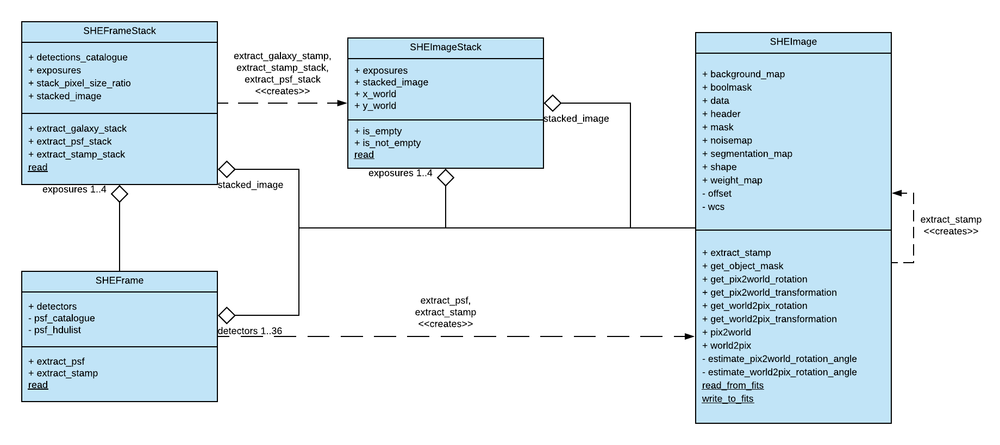

# SGS SHE_PPT Documentation

SHE_PPT is a module with many common tools used throughout the SHE pipeline.

## Software identification

* Processing Element Name: PF-SHE
* Project Name: SHE_PPT
* Profile: develop
* Version: 9.7 (2024/03/08)

## Contributors

### Active Contributors

* Bryan Gillis (b.gillis@roe.ac.uk)
* Malte Tewes (mtewes@astro.uni-bonn.de)
* Nicholas Cross (njc@roe.ac.uk)
* Giuseppe Condego (giuseppe.congedo@ed.ac.uk)
* Gordon Gibb (gordon.gibb@ed.ac.uk)

### Other Contributors

* Katie Eckhard (kathleen.eckert@gmail.com)

## Purpose

This repository contains general SHE functions, classes and product definitions. Some important examples are:

1. `SHEFrameStack`,  a class that produces an instance of the image data, the background, flag, weight, and segmentation images and tools to extract postage stamps for object lists.  
2. the `.xml` product definition and `.fits` table definition code for all SHE data products and VIS, MER and other input data products.
3. Pipeline configuration code.

## Relevant Documents

* [RSD](https://euclid.roe.ac.uk/attachments/download/54815)
* [SDD](https://euclid.roe.ac.uk/attachments/download/54782/EUCL-IFA-DDD-8-002.pdf)
* [VP/STS](https://euclid.roe.ac.uk/attachments/download/54785/EUCL-CEA-PL-8-001_v1.44-Euclid-SGS-SHE-Validation_Plan_STS.pdf)
* [STP/STR](https://euclid.roe.ac.uk/attachments/download/54784/EUCL-IFA-TP-8-002_v1-0-0.pdf)

## Dependencies

### Internal Euclid Dependencies

N/A

### External Euclid Dependencies

* [EL_Utils 1.5.2](https://gitlab.euclid-sgs.uk/EuclidLibs/EL_Utils)
* [ST_DataModelTools 9.2.2](https://gitlab.euclid-sgs.uk/ST-DM/ST_DataModelTools)
* [ST_DataModel 9.2.0](https://gitlab.euclid-sgs.uk/ST-DM/ST_DataModel)
* [Elements 6.2.1](https://gitlab.euclid-sgs.uk/ST-TOOLS/Elements)

### Configuration

**EDEN 3.1**
```
    - astropy 5.2.1
    - scipy 1.10.1
    - numpy 1.23.5
    - python 3.9.15
```

### Dependant Projects

* [SHE_MER](https://gitlab.euclid-sgs.uk/PF-SHE/SHE_MER)
* [SHE_PSFToolkit](https://gitlab.euclid-sgs.uk/PF-SHE/SHE_PSFToolkit)
* [SHE_LensMC](https://gitlab.euclid-sgs.uk/PF-SHE/SHE_LensMC)
* [SHE_MomentsML](https://gitlab.euclid-sgs.uk/PF-SHE/SHE_MomentsML)
* [SHE_GST](https://gitlab.euclid-sgs.uk/PF-SHE/SHE_GST)
* [SHE_Validation](https://gitlab.euclid-sgs.uk/PF-SHE/SHE_Validation)
* [SHE_CTE](https://gitlab.euclid-sgs.uk/PF-SHE/SHE_CTE)
* [SHE_IAL_Pipelines](https://gitlab.euclid-sgs.uk/PF-SHE/SHE_IAL_Pipelines)


### Dependant Pipelines

* [SHE Analysis](https://gitlab.euclid-sgs.uk/PF-SHE/SHE_IAL_Pipelines/-/blob/develop/SHE_Pipeline/auxdir/SHE_Shear_Analysis/PipScript_SHE_Shear_Analysis.py)
* [Shear Calibration](https://gitlab.euclid-sgs.uk/PF-SHE/SHE_IAL_Pipelines/-/blob/develop/SHE_Pipeline/auxdir/SHE_Shear_Calibration/PipScript_SHE_Shear_Calibration.py)
* [SHE Global Validation](https://gitlab.euclid-sgs.uk/PF-SHE/SHE_IAL_Pipelines/-/blob/develop/SHE_Pipeline/auxdir/SHE_Global_Validation/PipScript_SHE_Global_Validation.py)
* [SHE_Shear_Reconcilation](https://gitlab.euclid-sgs.uk/PF-SHE/SHE_IAL_Pipelines/-/blob/develop/SHE_Pipeline/auxdir/SHE_Shear_Reconciliation/PipScript_SHE_Shear_Reconciliation.py)

## Installation

All Euclid projects will be deployed via cvmfs. If this is installed and set up, this project will be pre-installed and no further work will be necessary. In case cvmfs isn't installed, or you wish to install an unreleased build or older build, you can do so through the following process:

```bash
cd ${HOME}/Work/Projects
git clone git@gitlab.euclid-sgs.uk:PF-SHE/SHE_PPT.git
cd SHE_PPT
git checkout <desired branch or tag>
make
make test
make install
```

## Main Programs Available

SHE_PPT is not a standard package with executables that are run in the SHE pipeline, but instead a package with a lot of the important infrastructure used by all of the other packages. These include:

* `SHEFrameStack`,
* Product definitions for use with `.xml` files described in the Data Model
* Table format files for creating FITS catalog tables
* General utility functions useful to all SHE projects

### Details of `SHEFrameStack`

`SHEFrameStack` is a structure containing all needed data for shape measurement, represented as a list of SHEFrames for detector image data, a stacked image, a list of PSF images and catalogues, and a detections
catalogue. These are generated from reading in the required set of VIS frames, MER final catalogue, reprojected segmentation images andlist of object ids. Not all of these inputs are necessary to generate a SHEFrameStack and other options relate to how the structure is stored in memory, which can affect performance later on.

### Details of `products`

`products` is a directory containing a set of files, e.g. [`she_psf_model_image.py`](https://gitlab.euclid-sgs.uk/PF-SHE/SHE_PPT/-/blob/develop/SHE_PPT/python/SHE_PPT/products/she_psf_model_image.py), that generates a binding to the data model with additional functionality, such as `create_dpd_she_psf_model_image` which will generate a new data product for the PSF model. Most of the common parts of these files are contained in the [`product_utility.py`](https://gitlab.euclid-sgs.uk/PF-SHE/SHE_PPT/-/blob/develop/SHE_PPT/python/SHE_PPT/product_utility.py) file.
These tools are used throughout the SHE project, and are necessary for use with the `read_xml_product` and `write_xml_product` functions in [`file_io.py`](https://gitlab.euclid-sgs.uk/PF-SHE/SHE_PPT/-/blob/develop/SHE_PPT/python/SHE_PPT/file_io.py). `products` contains files for all data products used in SHE, including relevant VIS, MER and other data products.

### Details of `table_formats`

`table_formats` is a directory containing a set of files, e.g. [`she_psf_model_image.py`](https://gitlab.euclid-sgs.uk/PF-SHE/SHE_PPT/-/blob/develop/SHE_PPT/python/SHE_PPT/table_formats/she_psf_model_image.py), that generates a correct FITS table with the necessary header keys. Most of the common parts of these files are contained in the [`table_utility.py`](https://gitlab.euclid-sgs.uk/PF-SHE/SHE_PPT/-/blob/develop/SHE_PPT/python/SHE_PPT/table_utility.py) file. The functions allow the user to check if the table is in the correct format, create an initial table, add rows. These modules are used throughout SHE whenever new data tables are created.

## Running the software

### `SHEFrameStack`

This does not have a main executable, but this class structure is set up using the `.read()` function, which has the following inputs.  

**Inputs**

|  **Argument** |**Description** | **Required** | **Default** |
| :----------------   | :--------------- | :----------: | :----------:|
| `exposure_listfile_filename` `filename` | `.json` Filename of the listfile pointing to the exposure image data products. These products are VIS calibrated frames (DpdVisCalibratedFrame) | no | None |
| `seg_listfile_filename` `filename` | `.json` Filename of the listfile pointing to the exposure segmentation map files (DpdSheExposureReprojectedSegmentationMap) | no | None |
| `stacked_image_product_filename` `filename` | `.xml` Filename of the stacked image data product (DpdVisStackedFrame)| no | None |
| `stacked_seg_filename` `filename` | `.xml` Filename of the stacked segmentation map file (DpdSheStackedReprojectedSegmentationMap)| no | None |
| `psf_listfile_filename` `filename` | `.json` Filename of the listfile pointing to the psf data products (DpdShePsfModelImage) | no | None |
| `detections_listfile_filename` `filename` | `.json` Filename of the listfile pointing to the detections catalog data products (DpdMerFinalCatalog) | no | None |
| `object_id_list` <1,2,3,4...> | Iterable list of integer object ids  | no | None |
| `object_id_list_product_filename` `filename` | `.json` Filename of the product containing the object IDs we want to process. If provided, the detections table will be pruned to only contain these objects, and only detectors with at least one object in from the list in them will be loaded. (DpdSheObjectIdList) | no | None |
| `workdir` `str` | Work directory |  no | '.' |
| `save_products` <True/False> | If set to True, will save references to data products. Otherwise these references will be None | no | False |
| `load_images` <True/False> | If set to False, image data will not be loaded, and filehandles will be closed. | no | True |
| `prune_images` <True/False> | If True, will only load images where at least one object from the detections catalogue is present | no | None |

The structure of `SHEFrameStack` is described in the following UML diagram:




The `SHEFrameStack` structure has the following attributes:

* exposures : list<SHEImage> List of SHEImage objects representing the different exposures
* stacked_image : SHEImage The stacked image
* bulge_psf_images : list<SHEImage> List of bulge PSF images
* disk_psf_images : list<SHEImage> List of disk PSF images
* psf_catalogues : list<astropy.table.Table> List of PSF catalogues
* detections_catalogues : astropy.table.Table Detections catalogue, provided by MER

There are various useful functions in `SHEFrameStack`, or subclasses `SHEFrame` or `SHEImage` such as postage stamp extraction functions (e.g. `extract_galaxy_stack`, `extract_psf_stack`, `extract_stamp_stack`, `extract_stamp`) and coordinate system transforms (e.g. `get_world2pix_transformation`, `get_fov_coords`).

## Troubleshooting


### A test failed when I ran "make test"

_**Ensure you have the most up-to-date version of the project and all its dependencies**_

It's possible the issue you're hitting is a bug that's already been fixed, or could be due to locally-installed versions of projects on the develop branch no longer being compatible with a newly-deployed version of another dependency on CODEEN. If you're running on the develop branch and have installed locally, pull the project, call `make purge`, and install again, and repeat for all dependencies you've installed locally. Try running `make test` again to see if it works.

_**Report the failing test to the developers**_

If the test still fails, please report it to the active developers listed above, ideally by creating a GitLab issue, or else by e-mailing them.

_**Try running the desired code**_

Tests can fail for many reasons, and a common reason is that the code is updated but not the test. This could lead to the test failing even if the code works properly. After you've reported the issue, you can try to run the desired code before the issue with the failing test has been fixed. There's a decent chance that the bug might only be in the test code, and the executable code will still function.

### An exception was raised, what do I do?

_**Check for an issue with the input**_

First, look through the exception text to see if it indicates an issue with the input data. This will often be indicated by the final raised exception indicating an issue with reading a file, such as a SheFileReadError which states it cannot open a file. If this is the case, check if the file exists and is in the format that the code expects. If the file doesn't exist, then you've found the problem. Either a needed input file is missing, or one of the input files points to the incorrect filename. Determine which this is, and fix it from there.

If the file does exist but you still see an error reading from it, then the issue is most likely that the file is unreadable for some reason - perhaps the download was corrupt, perhaps manual editing left it improperly formatted, etc. Try to test if this is the case by reading it manually. For instance, if the program can't open a `FITS` file, try opening it with `astropy`, `ds9`, `topcat` etc. (whatever you're comfortable with) to see if you can read it external to the code.

Keep in mind that the code might try multiple methods to open a file. For instance, the pipeline_config input file can be supplied as either a raw text file, an `.xml` data product, or a `.json` listfile. The program will try all these options, and if all fail, the final exception text will only show the final type attempted. The full traceback, however, should show all attempts. So if it appears that the program tried to read a file as the wrong type, check through the traceback to see if it previously tried to read it as the expected type and failed.

_**Ensure you have the most up-to-date version of the project and all its dependencies**_

It's possible the issue you're hitting is a bug that's already been fixed, or could be due to locally-installed versions of projects on the develop branch no longer being compatible with a newly-deployed version of another dependency on CODEEN. If you're running on the develop branch and have installed locally, pull the project, call `make purge`, and install again, and repeat for all dependencies you've installed locally. Try running again to see if this works.

_**See if the exception, traceback, or log gives you any other clue to solve the problem**_

There are many reasons something might go wrong, and many have been anticipated in the code with an exception to indicate this. The exception text might tell you explicitly what the problem is - for instance, maybe two options you set aren't compatible together. If it wasn't an anticipated problem, the exception text probably won't obviously indicate the source of the problem, but you might be able to intuit it from the traceback. Look through the traceback at least a few steps back to see if anything jumps out at you as a potential problem that you can fix. Also check the logging of the program for any errors or warnings, and consider if those might be related to your problem.

_**Report the issue**_

If all else fails, raise an issue with the developers on GitLab. Be sure to include the following information:

1. Any details of input data you're using.
1. The command you called to trigger the program (or the pipeline which called the program)
1. The full log of the execution, from the start of the program to the ultimate failure. In the case of a failure during a pipeline run, you can attach the generated log file for this executable, which can be found in the `logs` directory within the work directory, and then in a subdirectory corresponding to this task.
1. Any steps you've taken to try to resolve this problem on your own.
